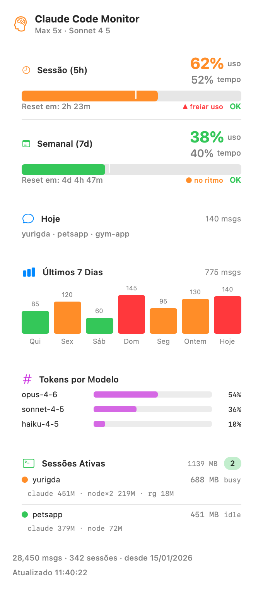

# Claude Monitor — Case Study

> A native macOS menu-bar app that shows Claude Code rate limits at a glance, shipped
> end-to-end: native Swift app → signed & notarized installer → multilingual marketing
> site → Stripe donations.

**Role:** Solo — design, engineering, packaging, distribution, web, payments.
**Timeline:** Personal project. **Stack:** Swift 6 · SwiftUI · AppKit · HTML/CSS/JS · Stripe.
**Links:** [Website](https://github.com/YuriS5N/claude-monitor) · [Source](https://github.com/YuriS5N/claude-monitor) · [Download](https://github.com/YuriS5N/claude-monitor/releases/latest)

---

## The problem

Claude Code enforces usage limits on a 5-hour window and a 7-day window. Hitting one mid-task
is disruptive, and the only way to check your standing was to read HTTP response headers by
hand. I wanted my usage — and how fast I was burning it — visible at a glance, without a
terminal.

A second, harder question showed up once the first was solved: **am I on the right plan?** The
subscription buys a quota that resets weekly and is billed monthly, the vendor exposes no
history at all, and "value received" and "quota consumed" turn out to be different questions
that can point in opposite directions. Answering that honestly drove most of the engineering
below.

## The solution

A menu-bar app with two layers.

**At a glance** — a native popover: 5-hour and weekly usage with a *pace marker* (time elapsed
vs. usage) and reset countdown, today's messages and projects, a 7-day chart colored against
your weekly average, tokens by model, and active Claude Code sessions. The menu-bar title stays
compact and adapts to how much room the menu bar has.

**In depth** — an analytics window that answers the plan question:

- **Quota utilization** — weekly consumption as bars, with dotted ceilings for the *other*
  plans, so "would a cheaper tier have fit?" is a visual answer. Reconciled month by month,
  since the limit resets weekly but the bill is monthly — and unused weekly quota never rolls
  over, which is the point most people miss.
- **Paid vs. actually used** — what the usage would have cost at pay-as-you-go API prices,
  daily / monthly / cumulative, with trend and projection.
- **Per session and per project** — sortable, with real active time rather than wall-clock span.
- **A plan verdict** — derived from observed weekly peaks, and deliberately withheld until
  there is enough data to be worth trusting.

---

## Engineering highlights

### Real rate-limit data from response headers
There is no public "usage" endpoint. The app makes **one minimal 1-token Haiku call every 5
minutes** and reads the `anthropic-ratelimit-unified-*` headers (utilization, reset, status,
overage, fallback) off the HTTP response — the same unified limits Claude Code itself is bound
by. A deliberate, documented trade-off: a few input tokens every 5 minutes for live data.

### Zero-config auth via the macOS Keychain — and reverse-engineering multi-account
No login screen, nothing to paste: the app reads the OAuth token Claude Code already stores in
the Keychain and keeps refreshed. Auth "just works" because it reuses an existing trust boundary.

That got interesting when Claude Code moved to **per-account credentials** with opaque service
names like `Claude Code-credentials-022f5dfa`. The legacy entry stayed in place but with an
empty token, so the app silently 401'd. Worse, my first fix — "use whichever token expires
latest" — made the app hop to a different account whenever that one refreshed, so it reported
the wrong account's limits.

The real fix came from working out where the suffix comes from: it is
**`sha256(<absolute path of the config directory>)[:8]`**. Since Claude Code separates accounts
by `CLAUDE_CONFIG_DIR`, that makes account selection deterministic — pin a config directory and
everything (credentials, transcripts, history, sessions) follows from it. Guessing became
derivation.

### Native, dependency-free
No Xcode project, no SPM, no third-party packages — plain `swiftc` over `Sources/*.swift`.
`MenuBarExtra` + `NSApplicationDelegateAdaptor` with `setActivationPolicy(.accessory)` to stay
out of the Dock, plus a separate `NSWindow`/`NSHostingController` for the analytics view and
Swift Charts for the graphs.

### Measuring what the vendor doesn't expose
The API returns your *current* rate-limit utilization and no history at all. The app records
every poll, so the series it needs comes into existence over time — but that meant answering
"did I use what I paid for?" with "ask me in three weeks", which is a bad product answer.

Two measurements changed that. First, the weekly window turned out to run on a **fixed 7-day
cadence**, so past week boundaries are derivable (the 5-hour window is anchored to first
activity instead, and stays unreconstructable). Second, I had *rejected* estimating utilization
from token cost after concluding the relationship was non-linear — and that conclusion was
wrong: I had compared a **sliding** 5-hour peak against a **fixed**-window reading. Redone on
the weekly windows, two independent calibrations landed within 12% of each other.

So the app converts cost into quota using a ratio calibrated against the windows it actually
measured, labels those weeks as estimates, and replaces them with real readings as weeks pass.
The estimate is also honestly biased: a week that hits the ceiling stops spending, so cost
under-states demand — which the UI says out loud instead of hiding.

### Counting tokens correctly is mostly about knowing what to distrust
Summing `usage` across transcripts naively over-counts by ~2.2×, because streaming writes each
message about twice. Deduplicating by `message.id` fixes that — but the set has to span *files*,
since forked sessions replay history into new transcripts (measured: 2.2% of IDs appear in more
than one file). Bucketing by UTC day shifts every evening into tomorrow in a negative-offset
timezone. Subagent transcripts live one directory deeper and a one-level glob misses 109 of
them. And `sessionId` survives session resumes, so first-to-last span reports "1,000-hour
sessions" until you sum only the gaps that look like work.

Every one of those was found by re-implementing the same aggregation independently in Python and
diffing the two — which is now the project's standing check for anything that produces a number.

### Resilience against a real crash
After a macOS update, the app was dying to an **intermittent CoreText `NSException`** while
rendering the menu-bar text (`TAttributes::ApplyFont`) — a transient font-daemon failure that
became a `SIGABRT`. Fix: a tiny Objective-C shim (`AGTryBlock`) wraps the icon render, catches
the exception, logs it and keeps the previous icon; a `launchd` agent with
`KeepAlive.SuccessfulExit=false` restarts the app if it ever dies for another reason (but a
clean "Quit" does not restart). Diagnosing a native exception across the Swift/ObjC boundary
and neutralizing it without changing the UX was the most interesting bug of the project.

### An `--snapshot` render mode
The product screenshot is generated by the app itself: `--snapshot` renders the popover with
**fixed sample data** through SwiftUI's `ImageRenderer` to a retina PNG — never touching the
Keychain, the API, or real files. Deterministic marketing assets, straight from the source of
truth.

---

## From "compiles on my machine" to "my mom could install it"

The original install was `git clone && ./build.sh` — fine for developers, impossible for
everyone else. I built a real distribution pipeline:

- **Icon by code** — a CoreGraphics generator draws a coral squircle with a rate-limit gauge
  and the ◆ glyph, piped through `sips` + `iconutil` into a full `.icns`.
- **Proper `.app` bundle** — Info.plist (`LSUIElement`, versioning, min-OS), embedded icon.
- **Sign → notarize → staple** — hardened-runtime `codesign`, `notarytool submit --wait`,
  `stapler`. The result opens with a **double-click**, no Gatekeeper warnings.
- **`.dmg`** with a drag-to-Applications layout, published to **GitHub Releases**.

The download button always points at `releases/latest/download/ClaudeMonitor.dmg`, so cutting
a new release updates the site with zero web changes. See [`packaging/`](../packaging/).

---

## Marketing site

A self-contained, single-file landing page ([`docs/index.html`](index.html)) — no build step,
no framework, no external requests (works offline, deploys straight to GitHub Pages):

- **Design** — dark, warm-neutral theme with the app's coral accent; the real product
  screenshot floated on a soft glow.
- **i18n in 4 languages** — English, Portuguese, Spanish and French via a tiny JS dictionary
  with `data-i18n` / `data-i18n-html` bindings; the choice persists and respects the browser
  locale.
- **Honest by design** — the site states the requirement (an active Claude Code login) and the
  tiny per-call cost, rather than hiding them.

## Payments

A **"buy me a coffee"** flow with no backend: Stripe **Payment Links** (`submit_type=donate`,
hosted on `donate.stripe.com`) for ☕ $3 / 🍕 $5 / 🎉 $10 and a pay-what-you-want option, each
with a custom thank-you screen. The site wires the tiers to the links client-side and hides any
tier that isn't configured — so it degrades gracefully.

---

## What this project demonstrates

| Area | Evidence |
|------|----------|
| **Native macOS / Swift** | SwiftUI + AppKit menu-bar app, Swift/ObjC interop, `swiftc` build |
| **Debugging depth** | Caught & neutralized an intermittent CoreText `NSException` |
| **Reverse engineering** | Derived the per-account Keychain naming scheme (`sha256` of the config dir) from observation |
| **Measurement rigor** | Every number cross-checked against an independent re-implementation; a wrong "non-linear" conclusion found and corrected |
| **Statistical honesty** | Estimates labeled as estimates, known bias direction stated, verdicts gated on sample size |
| **Product thinking** | Pace markers, adaptive title, honest cost disclosure, `--snapshot` assets |
| **Distribution** | Developer ID signing, Apple notarization, `.dmg`, GitHub Releases |
| **Web & design** | Self-contained multilingual landing page, brand-consistent icon by code |
| **Payments** | Stripe Payment Links integration, no server required |
| **Shipping end-to-end** | Idea → app → installer → site → payments, solo |
